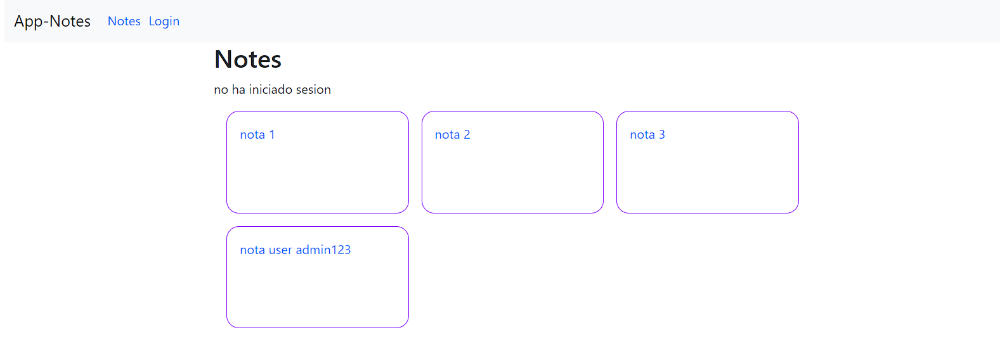
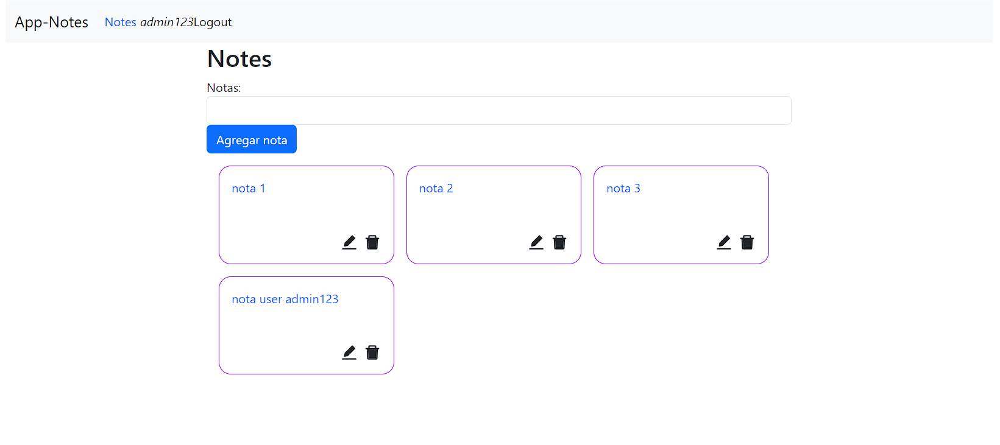
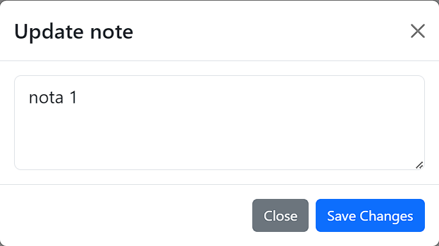

# CRUD  de Notas MERN

Este es un proyecto CRUD (Crear, Leer, Actualizar, Eliminar) de notas, donde las notas están disponibles para todos los usuarios para vizualizacion y para modificar o eliminar se debe iniciar sesión. Los usuarios iniciar sesión, y todas las peticiones se hacen con la autorización por cabecera de JSON Web Token (JWT)

## Tecnologías utilizadas

Este proyecto fue creado con el stack MERN (MongoDB, Express, React y Node.js). Las dependencias de producción del backend incluyen bcrypt, cors, dotenv, cross-env, express, jsonwebtoken, mongoose, mongoose-unique-validator. En el frontend, el proyecto fue creado con `npx create-app-[nombre]` y las dependencias de producción incluyen axios, bootstrap, react-bootstrap, react-icons, react-router-dom.

## Backend

Los endpoints de los usuarios, notas y login se refactorizaron en rutas (middleware). Cada una de estas rutas tiene que pasar por la libreria cors.

Al crear un usuario, la contraseña es encriptada con bcrypt y guardada en la base de datos de MongoDB. También se creó un middleware intermedio que se encarga de autenticar el token. La conexión a la base de datos utiliza variables de entorno.

El código está formateado con una configuración de ESLint.

## Frontend 

En el frontend, el proyecto está hecho con React y se Bootstrap para estilar. 

- Peticiones asincronicas: Para las peticiones asíncronas se utilizó la libreria de `axios`, haciendo uso tanto de funciones `async/await` como también de promesas.
- Enrutamiento: Se hizo uso de react router dom, para las diferentes direcciones, ademas se agrego renderizado condicional dependiendo si se ha iniciado sesión 
- Custom Hooks: Se hizo uso de customs Hooks
- Test: Se realizaron test unitarios de diferentes componentes con Jest-dom
- Test E2E: se realizaron tests E2E con cypress para probar la funcionalidad de la aplicación
- Persistencia de datos: los datos de retornados por la api(token) son guardados de manera local en localStorage

## Requisitos previos

Antes de instalar y utilizar este proyecto, asegúrate de tener instalado PostgreSQL en tu equipo. También deberás crear la base de datos y las tablas necesarias para el proyecto.

## Instalacíon

Para instalar este proyecto en tu equipo local, sigue estos pasos:
1. Clona este repositorio en tu equipo local.
2. Navega hasta el directorio del proyecto y ejecuta `npm install` para instalar todas las dependencias, esto debe realizarse tanto en la carpeta de app y Api.
3. Crea un archivo `.env` en el directorio de la Api y app del proyecto y agrega tus variables de entorno.
    - Las variables de entorno de la Api son:
        - PORTAPI
        - user
        - password
        - host
        - port
        - database
        - Secret
    - La varible de entorno de la app es:
        - REACT_APP_URL
4. Crea una base de datos en POSGRES donde se tenga usuarios y notas(esta configuracion ya esta en el archivo DB.sql de la raiz del proyecto), donde una nota solo puede tener un usuario pero un usuario puede tener varias notas (relación n:1)
5. Ejecuta `npm run api` para iniciar el servidor y luego se procede a iniciar la aplicacion con `npm run app`.
    
## Uso 

Para utilizar este proyecto, sigue estos pasos:
1. Abre tu navegador web y navega hasta http://localhost:3000.
2. Crea una cuenta o inicia sesión con una cuenta existente.
3. Una vez que hayas iniciado sesión, podrás crear, leer, actualizar y eliminar notas.
